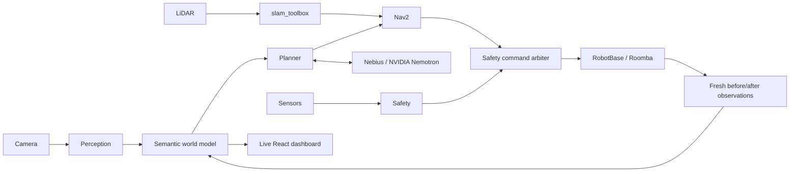

# NeuraVac

**A Physical AI robot vacuum that builds a semantic understanding of its environment, autonomously cleans debris while avoiding belongings and cable hazards, and visually verifies whether its cleaning actions actually succeeded.**

**Nebius Token Factory · NVIDIA Nemotron · ROS 2 Jazzy · Raspberry Pi 4**

> Observe the floor. Choose a safe task. Act. Observe again. Retry if debris remains.

Demo video/GIF: add the genuine hardware recording here after deployment. The repository includes a working deterministic simulator and a live dashboard. Real hardware, trained FloorMess weights, Pi performance and live cloud access require deployment validation; see [validation status](docs/TESTING.md).



## Quick start

Python 3.11 or 3.12 and Node 22 are recommended. Linux/macOS development needs no ROS, robot, GPU, camera, API key or trained model.

```bash
make install
make check
make demo
make dashboard
```

Open [the local dashboard](http://127.0.0.1:8000), then press **Start mission**. It boots in **IDLE**, shows the semantic room, avoids a cable, retries remaining debris, replans around a moved chair, and finishes after visual verification. `make demo` runs the same scenario faster than real time and writes `artifacts/demo.json`, SQLite history and `artifacts/demo-session.jsonl`.

`make dashboard` builds React to static assets before starting FastAPI. Node is needed only to build the frontend; there is no production Node server. `make sim` is an alias. For a live development frontend use `npm run dev` inside `dashboard/frontend` with the backend on port 8000.

## Genuine Nebius / NVIDIA use

The offline simulator uses deterministic planning and labels itself **offline**. To run the real client, create a Token Factory key, select an available NVIDIA Nemotron ID from your account's model catalog, and export these variables in your shell:

```bash
export NEBIUS_API_KEY='your-key'
export NEBIUS_BASE_URL='https://api.tokenfactory.nebius.com/v1'
export NEBIUS_MODEL='exact-NVIDIA-Nemotron-ID-from-your-account'
.venv/bin/python -m neuravac_core.cli dashboard --cloud
# or a recorded runtime showcase:
./scripts/run_demo.sh --cloud
```

The client verifies model availability, calls the actual API and displays its model, request ID and measured latency. Successful strict decisions are audited in SQLite; malformed output and timeouts fall back conservatively or pause. No cloud output controls wheels or changes safety. `.env.example` documents variables; the CLI reads environment variables and does **not** automatically load `.env`. Systemd can load its protected EnvironmentFile. See [Nebius setup](docs/NEBIUS.md) and [AI boundaries](docs/AI_ARCHITECTURE.md).

## Hardware and ROS

Target: Raspberry Pi 4 8 GB, ARM64 Ubuntu 24.04, ROS 2 Jazzy, 2D LiDAR, calibrated downward camera, suitable power supply and a verified OI-capable Roomba donor or watchdog MCU bridge. OI serial is 5 V TTL; the Pi is 3.3 V. Use a proper interface adapter and separate regulated Pi power. Do not power a Pi from the OI accessory pins.

```bash
# On the Pi; installs packages and builds the ROS workspace, never drives:
./scripts/install_pi.sh
# Edit config/robot.yaml for the verified donor and calibrate config/perception.yaml.
# Copy dashboard/frontend/dist from your workstation.
NEURAVAC_MODE=hardware ./scripts/start_robot.sh
NEURAVAC_MODE=hardware ./scripts/stop_robot.sh
```

The default backend is **mock**. Autonomous hardware movement requires real fresh base, LiDAR, camera, localization and mission heartbeat, successful self-test, a configured model, and an explicit mission-start action. Review [hardware](docs/HARDWARE.md), [ROS launch modes and interfaces](docs/ROS.md), and [safety](docs/SAFETY.md) before enabling a donor. Automatic docking is not implemented; return-home means a navigation goal at the mission origin.

## Tests, replay and tools

```bash
make test-unit
make test-integration
make test-scenarios
make replay SESSION=artifacts/demo-session.jsonl
make benchmark
make audit
./scripts/start_recording.sh
./scripts/replay_session.sh recordings/example.jsonl
python tools/benchmark_pi.py --duration 10
```

Hardware and billed cloud tests are excluded from default runs. `NEURAVAC_ALLOW_HARDWARE_TESTS=1 make test-hardware` additionally needs the donor port; wheel movement requires the explicit elevated-wheel flag. `NEURAVAC_ALLOW_CLOUD_TESTS=1 make test-cloud` additionally needs real credentials. See [testing and fault injection](docs/TESTING.md).

[FloorMess dataset tools](datasets/README.md) cover collection, near-duplicate review, grouped splits, label validation, visual annotation, training/export and edge-model evaluation. Training runs remotely, never on the Pi. No detector accuracy or 2–5 Hz Pi inference is claimed without a measured model.

## Repository

| Path | Responsibility |
|---|---|
| `neuravac_core/` | Safety, base abstractions/codecs, perception, world, missions, cleaning, cloud, storage/replay |
| `ros2_ws/src/` | Ten ROS packages and SLAM/Nav2/keepout launch integration |
| `sim/` | Seeded, footprint-aware 2D sensor and actuator simulator for CI |
| `dashboard/` | FastAPI backend and React/TypeScript static frontend |
| `datasets/`, `ml/` | FloorMess pipeline and remote training/export/evaluation |
| `config/`, `scripts/`, `systemd/` | Typed settings, deployment, recording and service startup |
| `tests/` | Unit, fake-device integration, scenarios, replay and opt-in deployment tests |

[Architecture](docs/ARCHITECTURE.md) · [milestone ledger](docs/IMPLEMENTATION_PLAN.md) · [performance](docs/PERFORMANCE.md) · [demo/video outline](docs/DEMO.md)

## Hackathon

Physical AI Track, Nebius x NVIDIA Global AI Hackathon. [Submission evidence checklist](docs/HACKATHON.md) makes cloud use, NVIDIA model usage, public-source licensing, the ≤3-minute video and real hardware footage explicit. [Feedback template](docs/HACKATHON_FEEDBACK.md) is intentionally unfilled until real usage supplies evidence.

## License

[MIT](LICENSE). Dataset, pretrained-weight and model licenses must be evaluated separately; Ultralytics training dependencies and their licensing are not re-licensed by this repository.
