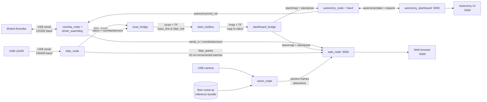

# NeuraVac

<p align="center">
  
</p>

NeuraVac is a ROS 2 robot platform built around an iRobot Roomba. It combines
direct Roomba control, USB LiDAR, SLAM Toolbox 2D mapping, Nav2 autonomous
frontier exploration, camera-based floor-object detection, and a browser
dashboard into one ROS 2 workspace.

The project is designed so that hardware drivers publish and consume ROS
topics instead of depending on each other directly:

- The Roomba node owns the Roomba's Open Interface serial connection, publishes
  wheel encoder odometry (`/odom`), and runs the safety watchdog (`driver_watchdog`).
- The LiDAR node parses scan packets and publishes individual range points (`/lidar_points`).
- The mapping package (`neuravac_mapping`) deskews 360° LiDAR revolutions against
  `/odom`, runs SLAM Toolbox (`async_slam_toolbox_node`), bridges `/slam/map` and
  `/slam/pose` for the dashboard, and coordinates Nav2 autonomous frontier mapping.
- The vision node publishes camera frames and object detections.
- The web node bridges ROS topics to a Flask dashboard for monitoring and
  manual control (`:5000`), while `autonomy_dashboard` serves the autonomous
  mapping operator page (`:5050`).
- The bringup package starts the complete robot with one launch command and
  provides stable USB device names.
- The interfaces package contains the messages shared by those nodes.

## System overview


```mermaid
flowchart LR
    Roomba[ iRobot Roomba ] <-->|USB serial<br/>115200 baud| R[roomba_node +<br/>driver_watchdog]
    Lidar[USB LiDAR] -->|USB serial<br/>230400 baud| L[lidar_node]
    L -->|lidar_points| SB[scan_bridge]
    R -->|odom + roomba/sensors| SB
    SB -->|/scan + TF<br/>base_link to lidar_link| ST[slam_toolbox]
    ST -->|/map + TF<br/>map to odom| DB[dashboard_bridge]
    Camera[USB camera] --> V[vision_node]
    Bundle[(floor-vision-pi<br/>inference bundle)] --> V

    R -->|serial_rx / roomba/sensors| W[web_node :5000]
    DB -->|slam/map + slam/pose| W
    DB -->|slam/map + slam/pose| AN[autonomy_node + Nav2]
    AN -->|autonomy/cmd_vel| R
    AN <-->|autonomy/state + request| AD[autonomy_dashboard :5050]
    L -->|lidar_points<br/>20 ms incremental batches| W
    V -->|camera frames<br/>detections| W
    W --> Browser[Web browser<br/>:5000]
    AD --> Operator[Autonomy UI<br/>:5050]
```

The hardware nodes can run independently. ROS 2 provides the transport and
the dashboard subscribes to the topics it needs. Vision detections contain
advisory actions such as `clean`, `avoid`, and `avoid_and_review`; the vision
node does **not** drive the Roomba.

The LiDAR reader polls every 2 ms and drains all complete packets from the
serial buffer, avoiding stale packet backlogs. The dashboard streams new
points incrementally in timestamped batches of up to 20 ms; the browser draws
on its next frame and keeps a rolling 250 ms visible.

The `roomba_node` requests `[149, 3, 0, 43, 44]` at 10 Hz and calculates
`/odom` from wheel encoder changes. Its 30-byte response contains 26 bytes of
group-0 telemetry followed by two bytes per wheel. `scan_bridge` deskews each
complete 360° LiDAR scan against `/odom` (using the physical mounting offset
`lidar_yaw_rad = +pi/2`, since `-90°` in `lidar_link` points forward along
`+X` of `base_link`) and publishes `/scan` to `slam_toolbox`. `dashboard_bridge`
republishes the resulting occupancy grid on `/slam/map` and the localized
`map -> base_link` transform on `/slam/pose`. Use **Reset & Remap** in the Room
map panel (or call `/slam/reset`) to clear the occupancy grid and restart mapping
from the robot's current position.

Collision handling discards partial, queued, and in-flight contact scans before
map insertion. Encoder counts received with bumper or wheel-drop flags are
consumed without advancing the pose, because spinning wheels need not mean
chassis motion.

The dashboard reads cached telemetry every five seconds and has a **Request
now** button. The `request_telemetry` ROS service requests and returns
fresh group-0 telemetry from the same serialized encoder query. The service
joins an outstanding query instead of inserting another serial transaction.
Only `roomba/sensors` carries the extracted 26-byte telemetry payload;
`serial_rx` remains the complete raw stream, including encoder bytes.

## ROS 2 packages

| Package | Type | Responsibility |
| --- | --- | --- |
| [`roomba`](src/roomba) | `ament_python` | Owns the Roomba serial port, publishes raw serial bytes and wheel odometry, runs the `driver_watchdog`, and serves on-demand telemetry requests. See [`src/roomba/README.md`](src/roomba/README.md). |
| [`lidar`](src/lidar) | `ament_python` | Reads the LiDAR serial stream, validates packets, decodes angle/distance/intensity, and publishes points. |
| [`neuravac_mapping`](src/neuravac_mapping) | `ament_python` | Deskews LiDAR scans (`scan_bridge`), runs SLAM Toolbox (`mapping.launch.py`), bridges `/slam/map` and `/slam/pose` (`dashboard_bridge`), and runs Nav2 autonomous frontier exploration (`autonomy.launch.py`). |
| [`neuravac_slam`](src/neuravac_slam) | `ament_python` | Legacy scan matcher (`slam_backend:=legacy`). Replaced by `neuravac_mapping` (`slam_backend:=toolbox`) by default. |
| [`roomba_interfaces`](src/roomba_interfaces) | `ament_cmake` | Builds the custom ROS 2 messages shared by the nodes. |
| [`vision`](src/vision) | `ament_python` | Captures camera frames, runs the deployed floor-vision model, and publishes detections. |
| [`web`](src/web) | `ament_python` | Runs the Flask dashboard and bridges browser actions and telemetry to ROS 2. |
| [`bringup`](src/bringup) | `ament_python` | Launches the robot nodes together and creates stable USB device names. |

### Interfaces and topics

#### Roomba serial bridge

| Topic | Type | Direction | Purpose |
| --- | --- | --- | --- |
| `serial_rx` | `roomba_interfaces/msg/SerialData` | Roomba -> ROS | Raw bytes received from the Roomba. |
| `serial_tx` | `roomba_interfaces/msg/SerialData` | ROS -> Roomba | Raw bytes sent to the Roomba. |
| `odom` | `nav_msgs/msg/Odometry` | Roomba -> ROS | Pose and velocity from encoder packets 43 and 44. |
| `roomba/sensors` | `roomba_interfaces/msg/SerialData` | Roomba -> ROS | Extracted 26-byte OI sensor group-0 packet. |
| `request_telemetry` | `roomba_interfaces/srv/RequestTelemetry` | ROS -> Roomba | Requests and returns a fresh 26-byte OI sensor group 0 response. |

`SerialData` contains a `uint8[] data` field. The Roomba node starts the
robot in safe mode and uses 115200 baud by default.

Read current telemetry from the dashboard or request an immediate sample from
ROS:

```bash
ros2 service call /request_telemetry roomba_interfaces/srv/RequestTelemetry "{}"
```

The SCI manual documents opcode 142 as the sensor request, packet code 0 as
the 26-byte all-sensor packet, and the distance/angle values as signed,
big-endian increments. See
[`docs/Roomba/Roomba_SCI_manual.md`](docs/Roomba/Roomba_SCI_manual.md).

#### LiDAR and SLAM mapping

| Topic or service | Type | Purpose |
| --- | --- | --- |
| `lidar_points` | `roomba_interfaces/msg/LidarPoint` | Decoded points containing `angle_deg`, `distance_mm`, and `intensity`. |
| `scan` | `sensor_msgs/msg/LaserScan` | Deskewed 360° scan in `lidar_link` published by `scan_bridge`. |
| `slam/map` | `nav_msgs/msg/OccupancyGrid` | 2D room occupancy grid in the `map` frame (`0` free, `100` occupied, `-1` unknown). |
| `slam/pose` | `geometry_msgs/msg/PoseStamped` | Localized robot position and heading in the `map` frame. |
| `slam/status` | `std_msgs/msg/String` | Mapping status (`TRACKING` or `WAITING FOR SCANS`). |
| `slam/reset` | `std_srvs/srv/Trigger` | Clears the SLAM Toolbox map and pose graph so fresh scans start a new map. |

The dashboard's **Reset & Remap** button calls `/slam/reset`. To reset from a
terminal:

```bash
ros2 service call /slam/reset std_srvs/srv/Trigger "{}"
```

The LiDAR node expects the D6 packet format described in the source and uses
230400 baud by default.

#### Autonomous mapping (`neuravac_mapping`)

| Topic, action, or service | Type | Purpose |
| --- | --- | --- |
| `autonomy/request` | `std_msgs/msg/String` | JSON mission commands (`start` with `return_goal`, `return`, `stop`). |
| `autonomy/state` | `std_msgs/msg/String` | JSON mission state (`idle`, `exploring`, `returning`, `complete`, `stopped`). |
| `autonomy/cmd_vel` | `geometry_msgs/msg/Twist` | Coordinator velocity commands forwarded to `driver_watchdog`. |
| `autonomy/driver_status` | `std_msgs/msg/String` | Watchdog state (`ARMED`, `DISARMED`, or latched stop reason). |
| `autonomy/arm` / `autonomy/disarm` | `std_srvs/srv/Trigger` | Arms or disarms autonomous motor output in `roomba_node`. |
| `navigate_to_pose` | `nav2_msgs/action/NavigateToPose` | Nav2 action server used for frontier and return navigation. |

#### Vision

| Topic | Type | Purpose |
| --- | --- | --- |
| `camera/image/compressed` | `sensor_msgs/msg/CompressedImage` | JPEG camera frames. |
| `camera/image_annotated/compressed` | `sensor_msgs/msg/CompressedImage` | JPEG frames with model annotations. |
| `camera/detections` | `roomba_interfaces/msg/VisionDetectionArray` | Object detections and advisory actions. |

See [`src/vision/README.md`](src/vision/README.md) for the model bundle,
parameters, detection labels, and deployment notes.

## Requirements

- Ubuntu/Linux with ROS 2 (the deployment documentation targets ROS 2 Jazzy)
- Python 3.10 or newer
- `colcon`, `rosdep`, and the ROS 2 packages required by the package manifests
  (including `ros-jazzy-slam-toolbox` and `ros-jazzy-navigation2` / `ros-jazzy-nav2-bringup`)
- `pyserial` for the USB serial devices
- Flask and OpenCV for the dashboard/camera features
- A deployed `floor-vision-pi` bundle for the vision node
- User access to the serial and camera devices (`dialout` and `video` groups
  are commonly required on Linux)

The project also declares the main Python dependencies in
[`pyproject.toml`](pyproject.toml).

## Build

Source ROS 2, install dependencies, build the workspace, and source the
generated setup file:

```bash
source /opt/ros/jazzy/setup.bash
cd ~/Neuravac
rosdep install --from-paths src --ignore-src -r -y
colcon build --symlink-install
source install/setup.bash
```

When only core robot and mapping packages are needed:

```bash
colcon build --packages-select roomba_interfaces roomba lidar neuravac_mapping neuravac_slam vision web bringup --symlink-install
```

Build `vision` after its model bundle dependencies are installed:

```bash
colcon build --packages-up-to vision --symlink-install
```

## Configure the hardware and USB names

The Roomba and LiDAR must use different serial devices. Do not configure both
nodes to use the same `/dev/ttyUSB*` path. The bringup package supports stable
names so the devices do not swap when they are plugged in in a different
order.

Install the udev rules once. The setup command asks you to unplug and replug
the Roomba cable, LiDAR, and webcam one at a time:

```bash
sudo usermod -aG dialout,video $USER
ros2 run bringup neuravac_udev_setup --install
ls -l /dev/neuravac_*
```

Log out and back in after changing groups. The resulting device names are:

| Device | Stable path |
| --- | --- |
| Roomba serial adapter | `/dev/neuravac_roomba` |
| LiDAR serial adapter | `/dev/neuravac_lidar` |
| Webcam | `/dev/neuravac_camera` |

The serial ports and baud rates are configured in:

- [`src/roomba/config/roomba_params.yaml`](src/roomba/config/roomba_params.yaml)
- [`src/lidar/config/lidar_params.yaml`](src/lidar/config/lidar_params.yaml)

The YAML files default to the physical USB port paths currently wired on the Pi
(`/dev/serial/by-path/platform-xhci-hcd.0-usb-0:1:1.0-port0` for the Roomba and
`/dev/serial/by-path/platform-xhci-hcd.1-usb-0:2:1.0-port0` for the LiDAR) so
that both `systemctl --user` and `ros2 launch bringup robot.launch.py` open the
correct serial ports even if `/etc/udev/rules.d/99-neuravac.rules` was generated
when the cables were in different USB sockets. Because CH340 (`1a86:7523`)
USB-serial adapters do not have unique serial numbers, they are identified by
their physical USB port — keep each adapter in the same USB port, or re-run
`ros2 run bringup neuravac_udev_setup --install` if you move a cable.

## Start the robot (with SLAM mapping and all nodes running)

Before starting, wake the Roomba by pressing **CLEAN** on the robot if it is
asleep. Make sure you only run **one** startup method at a time (either the
`systemd --user` services or manual `ros2 launch` terminals) so duplicate nodes
do not compete for the USB serial ports.

### Option A: Start all nodes via `systemd --user` services (recommended on the Pi)

On the Raspberry Pi, five user services manage the hardware drivers, SLAM
Toolbox mapping, web dashboard (`:5000`), and Nav2 autonomous mapping stack
(`:5050`):

| Service | Nodes started | Purpose |
| --- | --- | --- |
| `neuravac-roomba.service` | `roomba_node` | Roomba serial owner, `/odom` encoder odometry, `/roomba/sensors`, and `driver_watchdog`. |
| `neuravac-lidar.service` | `lidar_node` | D6 USB LiDAR driver publishing `/lidar_points`. |
| `neuravac-toolbox.service` | `scan_bridge`, `slam_toolbox`, `dashboard_bridge` | Deskews `/lidar_points` into `/scan`, runs SLAM Toolbox, and publishes `/slam/map`, `/slam/pose`, and TF (`map -> odom -> base_link -> lidar_link`). |
| `neuravac-dashboard.service` | `web_node` | Main Flask dashboard on `http://<pi-ip>:5000`. |
| `neuravac-autonomy.service` | `controller_server`, `planner_server`, `bt_navigator`, `lifecycle_manager_autonomy`, `autonomy_node`, `autonomy_dashboard` | Nav2 stack, autonomous frontier explorer (starts with `enable_motion:=false`), and operator UI on `http://<tailscale-ip>:5050`. |

Start all five services together:

```bash
systemctl --user start \
  neuravac-roomba.service \
  neuravac-lidar.service \
  neuravac-toolbox.service \
  neuravac-dashboard.service \
  neuravac-autonomy.service
```

Check that all services are `active (running)`:

```bash
systemctl --user status 'neuravac-*' --no-pager
```

Stop all services cleanly:

```bash
systemctl --user stop \
  neuravac-autonomy.service \
  neuravac-toolbox.service \
  neuravac-dashboard.service \
  neuravac-lidar.service \
  neuravac-roomba.service
```

#### Running a supervised autonomous mapping mission

By default, `neuravac-autonomy.service` launches with `enable_motion:=false` so
the robot cannot move autonomously until explicitly enabled.

1. Open the main dashboard at `http://<pi-ip>:5000` and the autonomy operator
   page at `http://<tailscale-ip>:5050` (e.g., `http://100.106.145.39:5050`).
2. Confirm `/slam/status` is `TRACKING` and the initial room scan is visible.
3. Enable autonomous motion for your supervised session:
   ```bash
   source /opt/ros/jazzy/setup.bash
   source ~/Neuravac/src/neuravac_mapping/deployment/runtime-env.sh
   source ~/Neuravac/install/setup.bash
   ros2 param set /autonomous_mapping enable_motion true
   ```
4. In the `:5050` operator UI:
   - Click a green known-free cell on the map to set the **return point**.
   - Click **Start mapping** to arm the watchdog and explore reachable frontiers.
   - Click **End & return** at any time to cancel frontier exploration and
     navigate back to the selected return point, or click **Stop & wait** for an
     immediate halt and disarm.
5. When finished, lock autonomous motion and disarm the watchdog:
   ```bash
   ros2 param set /autonomous_mapping enable_motion false
   ros2 service call /autonomy/disarm std_srvs/srv/Trigger "{}"
   ```

### Option B: Start all nodes manually via `ros2 launch`

If you prefer to run the nodes interactively in terminals (including
`vision_node`), first ensure the background systemd services are stopped:

```bash
systemctl --user stop \
  neuravac-autonomy.service \
  neuravac-toolbox.service \
  neuravac-dashboard.service \
  neuravac-lidar.service \
  neuravac-roomba.service
```

**Terminal 1 — Hardware drivers, SLAM Toolbox mapping, vision, and main dashboard (`:5000`):**

```bash
source /opt/ros/jazzy/setup.bash
source ~/neuravac-web-venv/bin/activate
source ~/Neuravac/src/neuravac_mapping/deployment/runtime-env.sh
source ~/Neuravac/install/setup.bash
ros2 launch bringup robot.launch.py slam_backend:=toolbox
```

This single launch command starts:
- `roomba_node` (Roomba serial bridge, encoder `/odom`, `driver_watchdog`)
- `lidar_node` (USB LiDAR driver)
- `neuravac_mapping/mapping.launch.py` (`scan_bridge`, `slam_toolbox`, `dashboard_bridge`)
- `vision_node` (floor-vision camera model)
- `web_node` (main dashboard at `http://localhost:5000`)

Useful `robot.launch.py` arguments:

```bash
# Run without the floor-vision model (web_node captures /dev/neuravac_camera directly)
ros2 launch bringup robot.launch.py slam_backend:=toolbox use_vision:=false camera_device:=/dev/neuravac_camera

# Record diagnostic rosbags to ~/Neuravac/logs/
ros2 launch bringup robot.launch.py slam_backend:=toolbox use_diagnostics:=true

# Use the legacy scan matcher instead of SLAM Toolbox
ros2 launch bringup robot.launch.py slam_backend:=legacy
```

**Terminal 2 (optional) — Nav2 autonomous mapping coordinator and operator UI (`:5050`):**

```bash
source /opt/ros/jazzy/setup.bash
source ~/Neuravac/src/neuravac_mapping/deployment/runtime-env.sh
source ~/Neuravac/install/setup.bash
NEURAVAC_AUTONOMY_HOST=0.0.0.0 ros2 launch neuravac_mapping autonomy.launch.py enable_motion:=false
```

### Start vision standalone

Deploy the inference bundle as described in
[`src/vision/README.md`](src/vision/README.md), then start the node with its
bundle path:

```bash
ros2 run vision vision_node --ros-args \
  -p bundle_dir:=$HOME/floor-vision-pi \
  -p camera_index:=0 \
  -p inference_hz:=5.0
```

The vision node publishes detections and annotated images, but it does not
publish Roomba drive commands.

## Inspect the ROS graph

Useful commands while the system is running:

```bash
source /opt/ros/jazzy/setup.bash
source ~/Neuravac/src/neuravac_mapping/deployment/runtime-env.sh
source ~/Neuravac/install/setup.bash

ros2 node list
ros2 topic list
ros2 topic echo /slam/status --once
ros2 topic echo /slam/pose --once
ros2 topic echo /autonomy/state --once
ros2 topic echo /autonomy/driver_status --once
ros2 topic hz /scan
```

To confirm which nodes own a topic:

```bash
ros2 topic info /serial_tx
ros2 topic info /lidar_points
ros2 topic info /slam/map
```

## Testing

Run the package tests after sourcing ROS:

```bash
colcon test --event-handlers console_direct+
colcon test-result --verbose
```

Run the `neuravac_mapping` unit and isolated ROS test suite (`61` tests):

```bash
source /opt/ros/jazzy/setup.bash
source ~/Neuravac/install/setup.bash
cd ~/Neuravac/src/neuravac_mapping
ROS_DOMAIN_ID=55 python3 -m unittest discover -s tests -p 'test_*.py' -v
```

The web package also has focused unit tests:

```bash
PYTHONPATH=src/web:$PYTHONPATH python3 -m unittest discover -s src/web/tests
```

## Repository layout

```text
.
├── docs/                   Hardware manuals, architecture plans, and NeuraVac logo assets
├── src/
│   ├── bringup/            Full-robot launch file and USB udev setup
│   ├── lidar/              LiDAR ROS 2 node and configuration
│   ├── neuravac_mapping/   SLAM Toolbox bridge, Nav2 config, frontier planner, and watchdog
│   ├── neuravac_slam/      Legacy LiDAR scan matcher and 2D occupancy mapper
│   ├── roomba/             Roomba serial ROS 2 node, encoder odometry, and configuration
│   ├── roomba_interfaces/  Custom ROS 2 messages and services
│   ├── vision/             Camera and floor-object detection node
│   └── web/                Flask dashboard and ROS bridge
├── build/                  Colcon build output (generated)
├── install/                Colcon install output (generated)
└── pyproject.toml          Python project metadata and dependencies
```

## Hardware and protocol references

The web dashboard has an **LEDs & songs** panel for the power LED and short
Roomba tunes. The editor accepts note tokens such as `C4:32 D4:32`; durations
are measured in 1/64-second units. LED and song command limits are documented
in the [SCI manual](docs/Roomba/Roomba_SCI_manual.md).

- [Roomba SCI manual](docs/Roomba/Roomba_SCI_manual.md)
- [LiDAR documentation](docs/Lidar)
- [Autonomous mapping status](docs/plans/autonomous-mapping-status.md)
- [SLAM Toolbox migration](docs/plans/slam-toolbox-migration.md)
- [Vision package guide](src/vision/README.md)
- [Web dashboard guide](src/web/README.md)
- [Bringup package guide](src/bringup/README.md)

## Encoder positioning configuration

`src/roomba/config/roomba_params.yaml` contains nominal wheel diameter (0.072 m),
encoder counts per revolution (508.8), wheel track (0.235 m), left/right scale
factors, polling rate, query timeout, and startup delay. Wheel track is the
distance between wheel contact centers across the robot.

`roomba/encoder_counts` is `std_msgs/UInt16MultiArray`, ordered `[left, right]`,
preserving raw 16-bit patterns. Signed modular differences handle rollover in
both directions; the first sample establishes a baseline. Implausible jumps and
gaps over two seconds rebaseline without moving the estimated pose. Group-0
distance and angle are not used for positioning.

`roomba/sensors` contains the extracted 26-byte group-0 payload for web
telemetry, `scan_bridge` contact rejection, and `driver_watchdog` hazard checks.
Wake the robot with CLEAN if asleep before launching. Startup sends Start,
waits two seconds, then enters Safe mode and sends stop. Avoid injecting sensor
queries or stream commands through the manual serial console while the driver
owns the port.
