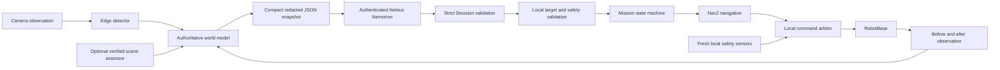

# AI architecture and trust boundaries

NeuraVac uses local observations and geometry to maintain its authoritative world. Nebius / NVIDIA Nemotron proposes a high-level next action. Local planning, target validation, safety and the command arbiter remain responsible for execution.

The cloud snapshot uses map-frame region and hazard positions, mission state, battery level and recent changes. Credentials and hidden reasoning keys are redacted before serialization. No inference response is a direct velocity, PWM or trajectory instruction. The cloud client requires strict JSON and finite schema-valid values, a complete provider response and the exact verified model identity. The world model then rejects stale, missing, unreachable or unsafe target IDs. A cloud failure raises sanitized `CloudError`; mission policy determines whether to pause or use conservative deterministic planning.

Cloud calls run asynchronously. Each HTTP attempt has a finite deadline; retries and backoff are bounded. Cancellation stops retries. The safety watchdog and arbiter continue independently of cloud latency. Restarting a client refreshes authenticated model availability; explicit `verify_model()` also refreshes it. A documentation example is never treated as proof of account access.

The optional physical scene assessor consumes an explicitly supplied JPEG/PNG/WebP frame through a configured, verified vision endpoint. Its strict HazardAssessment contains one class, finite confidence and hazard score, a traversability observation and a brief observable reason. It does not invent detections, floor coordinates or bounding boxes. A single assessment cannot certify all floor space safe. Low-confidence or unknown objects remain prohibited by the local semantic policy. This provider is disabled without explicit configuration; it has no guessed physical-AI API URL.

Persisted AI evidence consists of validated high-level decisions or observations and allowlisted operational telemetry: request identity, model, latency, numeric token counts and sanitized failure code. The client never logs full prompts, raw model messages, hidden reasoning fields or camera payloads. Safety events and physical BEFORE/AFTER observations must remain distinguishable from cloud advice. A successful cloud decision cannot imply a successful cleaning pass; verification requires a fresh observation after actual physical cleaning.

Ordinary CI tests are synthetic and network-free. Explicitly gated cloud tests demonstrate actual inference only when a valid account and model are supplied. Hardware video, genuine cloud evidence, deployment sensor validation and measured perception performance must be collected separately. See [Nebius setup and evidence](NEBIUS.md) for current official source references and the opt-in test command.
