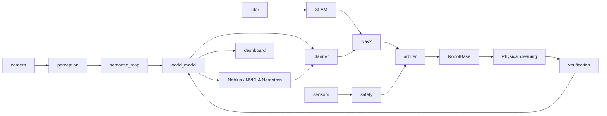

# NeuraVac architecture

NeuraVac understands floor objects, selects safe cleaning targets, acts, observes the result, and retries when debris remains. Target: Raspberry Pi 4, ARM64 Ubuntu 24.04, ROS 2 Jazzy, CPU-only 320-pixel edge perception. Heavy semantic reasoning runs on Nebius using an account-selected NVIDIA Nemotron model. Model availability must be verified at runtime; offline demos do not claim cloud use.

## Boundaries

The dependency-light `neuravac_core` owns typed configuration, schemas, protocol codecs, safety, semantic tracking, mission transitions, cleaning verification, storage, and recording. ROS adapters translate standard messages and JSON envelopes at their boundaries. Production geometric navigation uses Nav2 and SLAM uses slam_toolbox. A small grid search is restricted to the deterministic CI simulator.

`RobotBase` has asynchronous connection, velocity, cleaning motor, sensor, stop and emergency-stop operations. Only the base driver receives arbiter output. Mock, simulation, OI serial, and versioned MCU serial backends use the same API. Encoder support is configured by donor capability; unsupported odometry cannot be silently invented.

The arbiter gives emergency > safety > manual > navigation > idle priority. A 500 ms watchdog rejects stale/future/nonfinite commands. Safety observes fresh base, scan, camera, and process heartbeats; bumper, cliff, wheel-drop, communication loss, current, and battery rules inhibit movement. Emergency stop is latched and requires an explicit healthy reset. Base-local command expiry also stops if the arbiter dies. Software cannot guarantee a stop after Pi power loss: retain OI safe mode and use a physical stop and MCU watchdog for deployment.

## Perception and semantics

Mock detections come only from labeled simulation. Replay consumes recorded detections. ONNX expects an explicitly documented detector output contract and fails honestly when weights are missing. No pretrained floor detector or accuracy is claimed. Camera-to-floor projection uses calibrated intrinsics/extrinsics and rejects rays above the floor horizon. Tracking associates nearby observations by class, fuses confidence, and expires stale objects; uncertain possessions are prohibited. Debris clusters become targets. All poses and polygons use map-frame meters; timestamp ages use an injected monotonic clock, ROS messages carry ROS time.

## Mission and feedback

BOOTING → SELF_TEST → IDLE requires explicit start. SCANNING → PLANNING → NAVIGATING → CLEANING → VERIFYING includes a new BEFORE and AFTER observation for each pass. Remaining debris triggers bounded RETRYING. Dynamic obstacles invalidate routes and trigger REPLANNING. Unreachable targets are surfaced, never counted clean. Failed sensor observations cannot imply a zero debris score. Fresh high-confidence clean-floor polygons may reconcile prior debris only when they fully cover its observed geometry, no concurrent debris detection exists, and no hazard occupies the target. Unseen regions remain unresolved after tracking TTL expires. The world model, not the LLM, checks whether a target is currently valid, reachable, and safe.

Cloud output is a strict Pydantic high-level decision. Extra fields, motion instructions, unknown IDs, unsafe targets and invalid numbers are rejected. HTTP calls have bounded retries and timeouts. A cloud failure uses conservative deterministic planning or pauses by configuration. No cloud response changes safety. Optional vision reasoning requires an explicitly configured, verified endpoint.

## Runtime, storage and deployment

FastAPI exposes telemetry, mission controls, camera previews, SQLite history and bounded-rate WebSockets. React/TypeScript is built to static assets for the Pi. Localhost is the default bind address; remote controls require a configured token. Structured JSON logs and JSONL replay redact credentials. SQLite records missions, regions, cleaning attempts, safety and AI decisions. ROS recording adds rosbag2 topics.

## Validation limits

Ordinary CI uses fake serial, mocked HTTP, synthetic images and seeded simulation without hardware, API keys, trained weights, or ROS. ROS integration additionally requires Jazzy on Ubuntu; it is exercised in a separate CI container. Physical wheel direction, serial levels, sensor packet availability, camera calibration, ONNX accuracy/performance and real cloud access require deployment validation. Hackathon submission additionally requires a public repository, genuine runtime cloud evidence, feedback, and a real hardware video; no simulated result substitutes for these.
